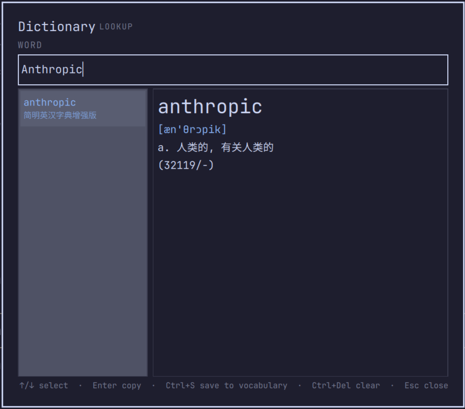

# Dictionary

An [Omarchy](https://omarchy.org/) shell plugin (Quickshell / QML) that turns
the current selection into an English → Chinese dictionary entry, using
[`sdcv`](https://github.com/Dushistov/sdcv) with the
[ECDICT](https://github.com/skywind3000/ECDICT) StarDict package.

Select a word anywhere, hit `Ctrl+Shift+S`, and read the definition in an
overlay. Search interactively, copy a clean entry, or save the word to an
Anki-importable vocabulary — no terminal popup involved.



## Features

- **Look up the selection** — reads the primary selection or clipboard,
  whichever you touched last, and normalizes it to a single lookup term.
- **Interactive search** — `Ctrl+Shift+D` opens an empty field; type and the
  definition updates as you go (debounced).
- **Loosening lookup** — a query escalates automatically: exact match → exact
  match lowercased → fuzzy suggestions, so `Ephemeral` and `ephemera` both
  land somewhere useful.
- **Copy** — `Enter` copies `word`, phonetic and definition as plain text.
- **Save to vocabulary** — `Ctrl+S` appends `word<TAB>definition` to a TSV,
  ready to import into Anki (newlines are stored as `<br>`).
- **Recently-touched source** — when the shared `omarchy-dict` helper is
  installed, the plugin agrees with the `dict-*` scripts on whether the
  selection or the clipboard was used last.

## Requirements

This plugin is third-party code that runs unsandboxed inside the Omarchy shell
process. It shells out to the following tools, all of which must be on `PATH`:

| Dependency | Purpose | Source |
| --- | --- | --- |
| `sdcv` | StarDict console client that performs the lookups | `extra/sdcv` |
| `stardict-ecdict` | The English → Chinese ECDICT dictionary data | AUR |
| `wl-clipboard` | `wl-copy` / `wl-paste` for selection and copy | `extra/wl-clipboard` |
| `bash`, coreutils | `selection.sh`, vocabulary writes | base |
| `omarchy-notification-send` | Save/no-result notifications | Omarchy |

```sh
sudo pacman -S sdcv wl-clipboard
yay -S stardict-ecdict      # AUR
```

`sdcv` finds the dictionary automatically under `/usr/share/stardict/dic/`.
Confirm it works before installing the plugin:

```sh
sdcv -n -j -e ephemeral
```

## Installation

### Via the Omarchy plugin CLI (recommended)

```sh
omarchy plugin add https://github.com/NonMirror/nonmirror.dict --enable
```

This clones the repository, validates the manifest, installs it to
`~/.config/omarchy/plugins/nonmirror.dict/`, and enables it.

### Manual installation

```sh
git clone https://github.com/NonMirror/nonmirror.dict \
  ~/.config/omarchy/plugins/nonmirror.dict
```

Then enable it in `~/.config/omarchy/shell.json` by adding it to `plugins`:

```json
"plugins": [
  { "id": "nonmirror.dict" }
]
```

The shell hot-reloads `shell.json` on save; force discovery with
`omarchy-shell shell rescanPlugins` if needed.

### Keybindings

Bind the hotkeys in `~/.config/hypr/bindings.lua`:

```lua
o.bind("CTRL + SHIFT + S", "Dictionary: look up selection",
  "omarchy-shell shell toggle nonmirror.dict '{\"mode\":\"lookup\"}'")
o.bind("CTRL + SHIFT + D", "Dictionary: search",
  "omarchy-shell shell toggle nonmirror.dict '{\"mode\":\"search\"}'")
o.bind("CTRL + SHIFT + ALT + S", "Dictionary: save word to vocabulary",
  "omarchy-shell shell summon nonmirror.dict '{\"mode\":\"save\"}'")
```

Then reload:

```sh
hyprctl reload
```

> **Note:** binding `Ctrl+Shift+S` / `Ctrl+Shift+D` at the compositor level
> shadows those chords in applications while focused. Move them to other
> bindings if that matters to you.

## Uninstallation

### Via the Omarchy plugin CLI (recommended)

```sh
omarchy plugin remove nonmirror.dict
```

### Manual removal

```sh
omarchy plugin disable nonmirror.dict
rm -rf ~/.config/omarchy/plugins/nonmirror.dict
omarchy-shell shell rescanPlugins
```

Remove the `nonmirror.dict` block from `~/.config/omarchy/shell.json` and the
three bindings above from `~/.config/hypr/bindings.lua`.

The plugin never creates its own state outside the vocabulary file, so nothing
else is left behind. To delete the saved words as well:

```sh
rm -f "${XDG_DATA_HOME:-$HOME/.local/share}/omarchy-dict/vocab.tsv"
```

## Usage

| Key | Action |
| --- | --- |
| `Ctrl+Shift+S` | Look up the current selection / clipboard |
| `Ctrl+Shift+D` | Open an empty search field |
| `Ctrl+Shift+Alt+S` | Look up the selection and save it to the vocabulary |
| type | Edit the search field (updates after a short debounce) |
| `↑` / `↓`, `Alt+J` / `Alt+K` | Move through the matches |
| `Enter` | Copy the current entry (or re-run the query if it produced nothing) |
| `Ctrl+S` | Save the current entry to the vocabulary |
| `Ctrl+V` | Paste the clipboard into the search field |
| `Backspace`, `Ctrl+Backspace`, `Ctrl+U` | Edit the field |
| `Ctrl+Del` | Clear the field |
| click a match | Select it |
| `Esc` / click outside | Close the overlay |

Copying and saving write a short status to the heading and post an
`omarchy-notification-send` notification (overwritten on repeat, so saves do
not pile up).

### Modes

The plugin can also be driven directly, which is what the keybindings do:

```sh
# Look up the selection / clipboard
omarchy-shell shell toggle nonmirror.dict '{"mode":"lookup"}'

# Open an empty search field
omarchy-shell shell toggle nonmirror.dict '{"mode":"search"}'

# Look up the selection and save the entry
omarchy-shell shell summon nonmirror.dict '{"mode":"save"}'

# Look up an explicit term
omarchy-shell shell toggle nonmirror.dict '{"mode":"lookup","term":"ephemeral"}'
```

## Vocabulary / Anki

Saved words go to a tab-separated file:

```
${XDG_DATA_HOME:-~/.local/share}/omarchy-dict/vocab.tsv
```

Each line is `term<TAB>definition`, with `<br>` standing in for line breaks
and HTML entities escaped, matching `~/.local/bin/dict-save` and the
`omarchy-dict` helper so existing imports keep working.

In Anki: **File → Import**, pick `vocab.tsv`, set the field separator to
**Tab** and enable **Allow HTML in fields**. The definition's `<br>` tags then
render as line breaks instead of literal text.

## How it works

- `Dict.qml` owns the overlay, the key handling and the `sdcv` calls. Queries
  run one at a time; a term typed while one is in flight is queued and run
  when the current one finishes, so a stale result can never win.
- `sdcv -n -j` returns JSON, which the QML parses directly. The exact-match
  stage adds `-e`, and fuzzy suggestions are reordered so the term you asked
  for is selected rather than buried at the end.
- `selection.sh` prints the lookup term. If the shared
  `${XDG_DATA_HOME:-~/.local/share}/omarchy-dict/lib.sh` helper exists it uses
  it (including the `dict-watch` primary-vs-clipboard timestamps); otherwise
  it falls back to the primary selection, then the clipboard.
- The plugin is self-contained. The `~/.local/bin/dict-*` scripts and
  `omarchy-dict/lib.sh` are optional; only the last-touched-source heuristic
  makes use of them.

## Development

Validate before committing:

```sh
omarchy plugin validate ~/.config/omarchy/plugins/nonmirror.dict
qmllint -I "$OMARCHY_PATH/shell" \
  ~/.config/omarchy/plugins/nonmirror.dict/Dict.qml
```

Saved changes under `~/.config/omarchy/plugins/` reload automatically; use
`omarchy-shell shell rescanPlugins` to force discovery.

## Notes and limits

- The dictionary is **English → Chinese**; other languages work only if you
  install additional StarDict dictionaries that `sdcv` picks up.
- The overlay grabs the keyboard exclusively while open
  (`WlrKeyboardFocus.Exclusive`), so compositor shortcuts other than the ones
  above are not available until it closes.
- `selection.sh` trims the selection to its first line and strips surrounding
  punctuation before looking it up; multi-word selections become the longest
  word only when the shared `omarchy-dict` helper is present.
- The vocabulary file is append-only from the plugin's side; de-duplicate or
  edit it by hand if needed.

## License

MIT — see [LICENSE](LICENSE).
